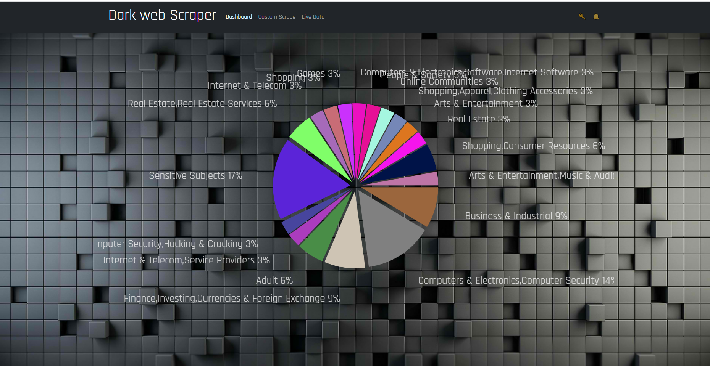
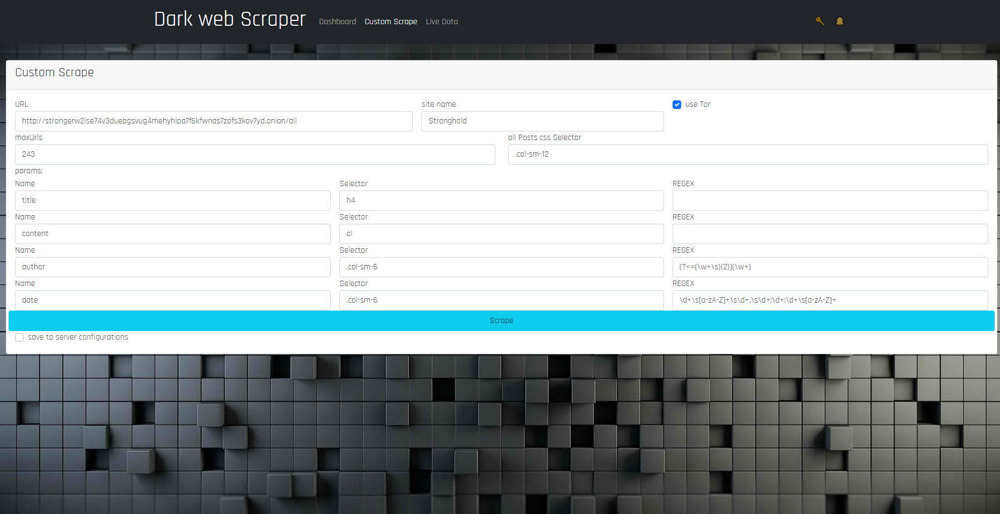
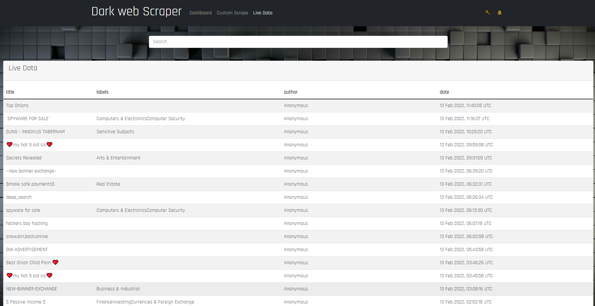
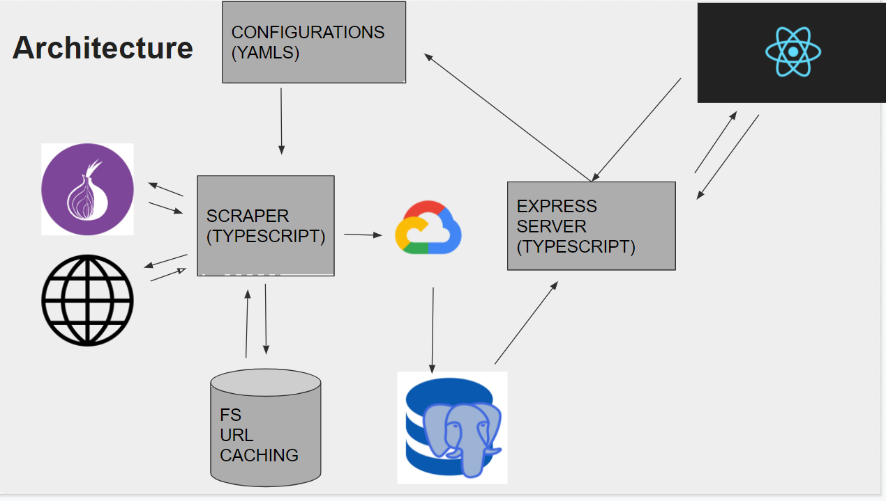

# darkweb scraper

A Typescript generic scraping platform that
connects to Tor browser through a docker
container.
The scraper runs through config files (. yaml),
Analyse the results in gcloud (GCP), And
saves the results in postgreSql database.
An Express server then exposes the server to
A React client side which uses Redux to
handle the data.

# Front-end
Dashboard:

Custom Scraping:

Live Data:


Architecture:



## back-end 
## Usage
clone this repo

## Installation


1. put your configuration in ./configs/sites

2. add .env file with:
- postgresql link as DATABASE_URL2="your link here"
- google as env:GOOGLE_APPLICATION_CREDENTIALAS =C:\dev\...your path to env file


3. ```bash
docker compose up
```

## Contributing
Pull requests are welcome. For major changes, please open an issue first to discuss what you would like to change.

Please make sure to update tests as appropriate.

## License
[MIT](https://choosealicense.com/licenses/mit/)