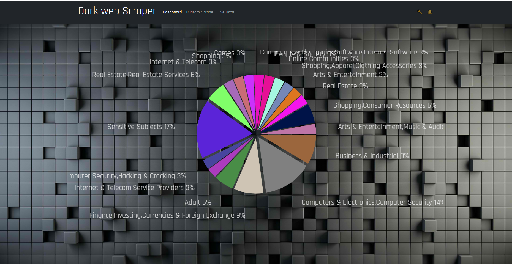
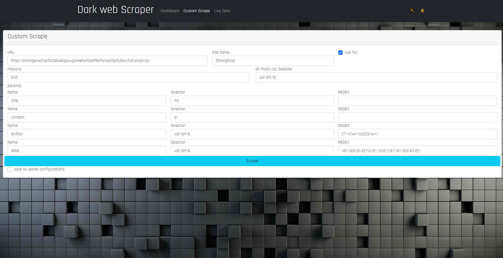
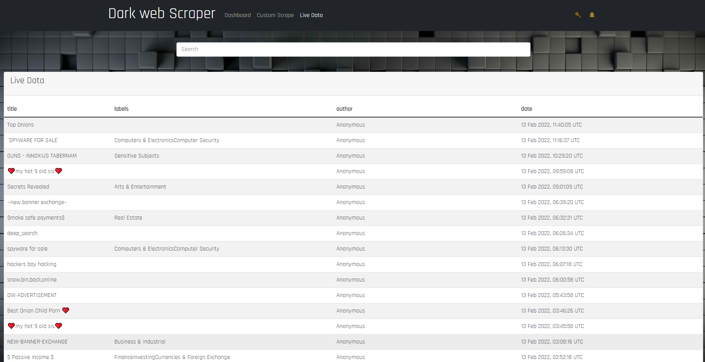
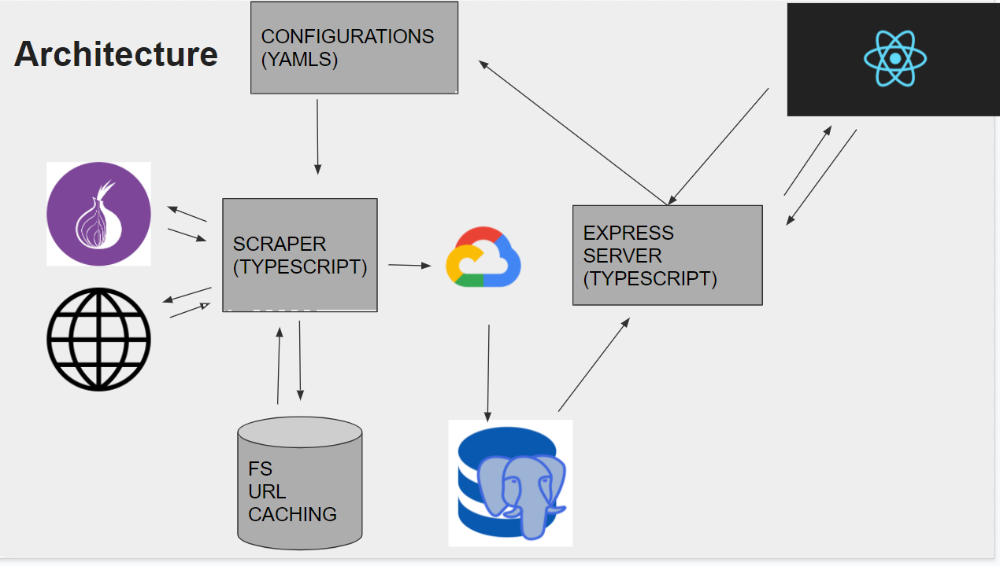

# Darkweb: scraper & analysis Front-end

A Typescript generic scraping platform that
connects to Tor browser through a docker
container.
The scraper runs through config files (. yaml),
Analyse the results in gcloud (GCP), And
saves the results in postgreSql database.
An Express server then exposes the server to
A React client side which uses Redux to
handle the data.

Dashboard:

Custom Scraping:

Live Data:

Architecture:

